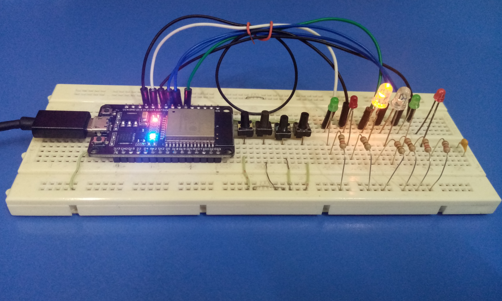

# Simple Smart Washing Machine using ESP32

This project simulates a smart washing machine using DOIT ESP32 DEVKIT V1 Board. It automates the basic washing process.

### GPIO Pin Assignments

In this project, outputs are represented by LEDs, and inputs by buttons configured with pull-up resistors:

- **GPIO 2 (Onboard LED)**: Used as a power or system indicator
- **GPIO 23 (Start Button)**: Initiates the washing process
- **GPIO 22 (Door Lock Button)**: Ensures the door is locked before the process starts
- **GPIO 14 (Water Valve)**: Controls the water valve to fill the drum
- **GPIO 21 (Upper Level Sensor)**: Stops water flow once the required level is reached
- **GPIO 12 (Heater)**: Simulates heating the water
- **GPIO 32 and GPIO 33 (Motor Control)**: Alternates between right and left rotations to mimic agitation
- **GPIO 25 (Discharge Pump)**: Drains water after washing is complete
- **GPIO 19 (Lower Level Sensor)**: Detects if the drum is empty
- **GPIO 26 (Warning LED)**: Blinks to indicate the washing cycle is complete

### Breadboard Setup

